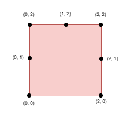

# 📐 Maximize the Distance Between Points on a Square

<div align="center">


### Select K Boundary Points While Maximizing the Minimum Manhattan Distance

</div>

---

## 📝 Problem

You are given:

- An integer `side`, representing the side length of a square.
- A list of unique boundary points `points`.
- An integer `k`.

The square has corners:

```text
(0,0)
(0,side)
(side,0)
(side,side)
```

Each point lies on the boundary of the square.

Your task is to select exactly **k points** such that the **minimum Manhattan distance** between any pair of selected points is as large as possible.

Return the maximum possible value of that minimum distance.

---

## 📏 Manhattan Distance

For two points:

```text
(x1, y1)
(x2, y2)
```

The Manhattan distance is:

```text
|x1 - x2| + |y1 - y2|
```

Example:

```text
(0,0) → (2,2)

Distance = |2-0| + |2-0|
         = 4
```

---

## Example 1

### Input

```text
side = 2

points =
[
 [0,2],
 [2,0],
 [2,2],
 [0,0]
]

k = 4
```

### Output

```text
2
```

### Visualization

<p align="center">
  
</p>

All four points must be selected.

The minimum Manhattan distance among all pairs is:

```text
2
```

---

## Example 2

### Input

```text
side = 2

points =
[
 [0,0],
 [1,2],
 [2,0],
 [2,2],
 [2,1]
]

k = 4
```

### Output

```text
1
```

### One Valid Selection

<p align="center">
  
</p>


The minimum Manhattan distance among selected points is:

```text
1
```

---

## Example 3

### Input

```text
side = 2

points =
[
 [0,0],
 [0,1],
 [0,2],
 [1,2],
 [2,0],
 [2,1],
 [2,2]
]

k = 5
```

### Output

```text
1
```

### One Valid Selection

<p align="center">
  
</p>


Minimum Manhattan distance:

```text
1
```

---

# 💡 Key Observation

Every point lies on the boundary of the square.

Instead of treating points as 2D coordinates, we can map each boundary point onto a position along the square perimeter.

Example perimeter ordering:

```text
Bottom Edge
→ Right Edge
→ Top Edge
→ Left Edge
```

This converts the problem into:

```text
Select k positions on a circular perimeter
while maximizing the minimum distance.
```

---

# 🔍 Why Binary Search?

Suppose we ask:

```text
Can we select k points
such that every pair is at least D apart?
```

If the answer is:

```text
YES for D
```

then it is also:

```text
YES for every smaller distance
```

This monotonic behavior immediately suggests:

```text
Binary Search on Answer
```

---

# 🚀 Approach

### Step 1

Convert every boundary point into a perimeter coordinate.

For a square:

```text
Perimeter = 4 × side
```

Each point gets mapped to a unique position on:

```text
[0, 4 × side)
```

---

### Step 2

Sort all perimeter positions.

---

### Step 3

Binary search the answer:

```text
low = 0
high = 2 × side
```

For each candidate distance:

```text
mid
```

check whether selecting:

```text
k points
```

with minimum Manhattan distance ≥ `mid`
is possible.

---

### Step 4

Use a greedy feasibility check.

If we can place:

```text
k points
```

while maintaining the required minimum distance,

then:

```text
mid is valid
```

otherwise:

```text
mid is impossible
```

---

# 🧠 Core Idea

The problem is not asking:

```text
Find the best set directly
```

Instead:

```text
Guess a distance D
↓
Can D work?
↓
Binary Search
```

This converts a difficult optimization problem into a sequence of easier feasibility checks.

---

# 📊 Complexity Analysis

| Complexity | Value |
|------------|--------|
| Sorting | O(n log n) |
| Binary Search | O(log(side)) |
| Feasibility Checks | O(n × k) |
| Total | O(n log n + nk log(side)) |

Where:

```text
n = points.length
```

---

# ✅ Accepted Java Solution

```java
// Paste Accepted Solution Here
class Solution {

    public int maxDistance(int side, int[][] points, int k) {
        List<Long> arr = new ArrayList<>();

        for (int[] p : points) {
            int x = p[0];
            int y = p[1];
            if (x == 0) {
                arr.add((long) y);
            } else if (y == side) {
                arr.add((long) side + x);
            } else if (x == side) {
                arr.add(side * 3L - y);
            } else {
                arr.add(side * 4L - x);
            }
        }
        Collections.sort(arr);

        long lo = 1;
        long hi = side;
        int ans = 0;

        while (lo <= hi) {
            long mid = (lo + hi) / 2;
            if (check(arr, side, k, mid)) {
                lo = mid + 1;
                ans = (int) mid;
            } else {
                hi = mid - 1;
            }
        }
        return ans;
    }

    private boolean check(List<Long> arr, int side, int k, long limit) {
        long perimeter = side * 4L;

        for (long start : arr) {
            long end = start + perimeter - limit;
            long cur = start;

            for (int i = 0; i < k - 1; i++) {
                int idx = lowerBound(arr, cur + limit);
                if (idx == arr.size() || arr.get(idx) > end) {
                    cur = -1;
                    break;
                }
                cur = arr.get(idx);
            }

            if (cur >= 0) {
                return true;
            }
        }
        return false;
    }

    private int lowerBound(List<Long> arr, long target) {
        int left = 0;
        int right = arr.size();
        while (left < right) {
            int mid = left + (right - left) / 2;
            if (arr.get(mid) < target) {
                left = mid + 1;
            } else {
                right = mid;
            }
        }
        return left;
    }
}
```

---

# 🧠 What This Problem Teaches

- Binary Search on Answer
- Greedy Verification
- Geometry Transformation
- Manhattan Distance
- Circular Perimeter Mapping
- Hard Optimization Problems

---

# 🏷️ Tags

```text
Hard
Binary Search
Greedy
Geometry
Sorting
Manhattan Distance
Optimization
```

---

# 🎯 Interview Insight

A common mistake is trying to work directly in 2D.

The breakthrough observation is:

```text
All points lie on the square boundary
```

which allows the square perimeter to be treated as a circular line.

Once transformed, the problem becomes:

```text
Maximize Minimum Distance
```

which is a classic Binary Search pattern.

---

<div align="center">

⭐ If you found this solution helpful, consider starring the repository.

</div>